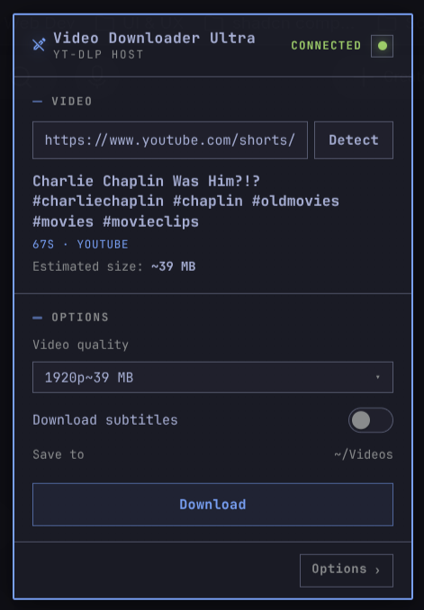
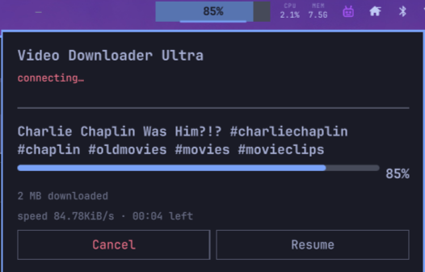
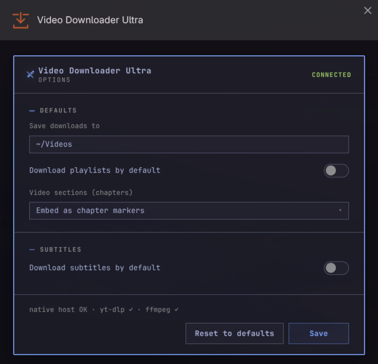

# Video Downloader Ultra

yt-dlp downloads for the Omarchy bar: a browser extension that probes the video
you are looking at, a shared queue that outlives the popup, and live progress in
Omarchy's own OSD.

The extension lists what the video offers, down to file sizes per resolution, so
you choose from the tracks that exist instead of a made-up quality ladder.
Everything runs on your machine: the host drives yt-dlp locally, so it never
needs your cookies or an account, and nothing you download leaves the box. The
queue is owned by a small native host rather than the popup, so a job started in
the browser keeps running in the bar after you close it and both surfaces show
the same list.

<p align="center">
  <a href="https://omarchyplugins.com/plugin.html?id=najmalzorqah.video-downloader-ultra"></a>
  <a href="https://github.com/NajmAlzorqah/video-downloader-ultra/tags"></a>
  <a href="LICENSE"></a>
</p>

## Demo

<p align="center">
  <video src=".github/assets/demo.mp4" width="720" controls>
    Your browser does not support the video tag.
  </video>
</p>

## Screenshots

<table>
  <tr>
    <td align="center">
      
      <br /><sub><b>Extension popup</b> — probe a video, pick quality, download</sub>
    </td>
    <td align="center">
      
      <br /><sub><b>Bar widget</b> — live progress in the Omarchy panel</sub>
    </td>
    <td align="center">
      
      <br /><sub><b>Options</b> — defaults for output dir, playlists, chapters, subtitles</sub>
    </td>
  </tr>
</table>

## What it does

- **One entry per resolution the video has**, highest first, with the best
  codec chosen for you. H.264 takes priority because it plays everywhere;
  VP9 and AV1 only appear when there is no H.264. The highest resolution is
  preselected, and **Audio only** extracts to MP3.
- **Sizes on the sample streams**, so every quality reads roughly what it will
  cost (`1080p · ~7 MB`) and the popup totals the download before you start.
  These come from yt-dlp's own `filesize`/`filesize_approx` values, not a
  lookup table.
- **Only the subtitle tracks that exist**, split into manual subtitles and an
  auto-generated captions group, listing the languages the video offers. A video
  with no Arabic track shows no Arabic.
- **Playlists.** Paste one, or open one, and the checkbox turns itself on. Every
  video downloads with the same choices, files are numbered in playlist order
  (`001_Title …`), and one bad video does not abort the rest.
- **Video sections.** Embed YouTube chapters as navigable markers, or split into
  one file per section, in which case the duplicate whole-video copy is cleaned
  up. The selector appears only when the video has chapters and the format can
  hold them.
- **A download queue.** Throw as many videos at it as you like; they run one at
  a time, a failure or a cancel moves on to the next, and any waiting item can
  be paused, resumed, reordered or removed.
- **Progress in the Omarchy OSD**, the same overlay the stock "Download Video"
  extension uses, plus a bar in the popup with percent, speed, ETA and Cancel.
- **Notifications when a download finishes**, styled like the defaults
  (`omarchy-notification-send`, thumbnail preview, "open in mpv"). Failures
  notify too.
- **Live theming.** The popup and options recolor when you run
  `omarchy theme set …`, reading the shell's own theme state through the host.

### Subtitles

Turn on **Download subtitles** and the language list fills with the tracks the
video offers. Only manual subtitles are eligible by default; auto-generated
captions download once you tick **Auto-generated**, and then only for the chosen
language (never a per-language flood). A video with no subtitles disables the
option with a hint. When a site is rate-limiting subtitle requests (YouTube's
HTTP 429), the host retries, then downloads without subtitles and says so in the
popup rather than failing silently.

## Deliberately absent

- **Cookies and accounts.** The host talks to yt-dlp directly, so no login state
  or browser profile is ever read. Members-only content is out of reach by
  design.
- **A "downloading" notification.** Progress is OSD-only. An earlier per-second
  toast wrote a new entry to the notification centre on every tick, so it was
  removed rather than tuned.
- **Resume.** There is no yt-dlp resume wiring. A browser restart restarts the
  active item from scratch and then replays the saved waiting jobs in order.
- **Its own progress overlay.** The card is the `panel` kind of this plugin, and
  stock `omarchy.osd` is untouched, so volume, brightness and media OSDs keep
  their single-row layout.
- **Anything on macOS.** This is a Linux desktop tool; the AirPods-style parity
  a Mac user might expect does not exist here.

## Requirements

- An Omarchy desktop (Quickshell based). The widget, the OSD and live theming
  all live there. Set `VDU_NO_OMARCHY=1` to run the host without the shell.
- `yt-dlp` and `ffmpeg` at `/usr/bin`. The host hardcodes those paths;
  `install.sh` will try `omarchy-pkg-add` for you if either is missing.
- `python3`, `sha256sum` and `base64`.
- A Chromium-family browser, **Chrome/Chromium 116 or newer**. `install.sh`
  covers ten profile roots: `chromium`, `google-chrome[-beta|-unstable]`,
  `BraveSoftware/Brave-Browser[-Beta|-Nightly|/Brave-Origin]`, and
  `microsoft-edge[-dev]`.

## Install

`omarchy plugin add` runs no plugin scripts, so installation is two steps:

```bash
omarchy plugin add https://github.com/NajmAlzorqah/video-downloader-ultra.git --enable
# then click the Video Downloader Ultra widget in the bar (it installs the browser side)
```

The widget's first click runs `install.sh`, streams its output, and flips to the
queue monitor when it is done. From a checkout, run it directly:

```bash
./install.sh
```

Then fully quit and restart your browser. The extension loads alongside the
other Omarchy extensions and appears in the toolbar.

## Remove

```bash
./uninstall.sh           # browser side + runtime
tools/omarchy-remove.sh  # the same, plus the plugin itself
```

`uninstall.sh` is marker-driven: it acts on what `install.sh` recorded rather
than on its own location, and removes exactly that: the native host manifests,
the extension path from `--load-extension=` in the recorded flags confs (edited
in place, so other tools' entries survive), the yt-dlp agent as a whole process
group so a mid-download yt-dlp is not orphaned, both runtime dirs, the removal
watcher, and the marker. Downloads are untouched, and `./install.sh` brings it
all back.

Removing the plugin itself is `omarchy plugin remove najmalzorqah.video-downloader-ultra --yes`. That
runs no scripts, so `install.sh` also arms a systemd path watcher that cleans up
the browser side once the plugin directory is really gone. A reinstall therefore
starts fresh, while plugin updates and installs served from your own dev
checkout are left alone.

## Usage

1. Open a video or playlist page, or paste a URL. The popup probes it for you.
2. Pick the quality this video offers, plus subtitles, playlist on/off,
   and a **Video sections** choice for videos with chapters.
3. Download. Progress shows in the OSD and the popup, and files land in your
   output dir (`~/Videos` by default, changeable in Options). Reopen the popup to
   line up more downloads, or use the queue section to reorder and remove rows.

A reopen restores the previous probe result for the same URL instantly, so the
options you chose come back without a refetch; only a URL change or **Detect**
fetches again. The popup follows the active tab while it is open, so SPA
navigations do not leave it stuck on the link it opened with.

## How it works

Two host processes sit under the browser. The one the native-messaging port
talks to is a thin **shim**: it forwards each length-prefixed JSON request over a
local unix socket to a long-lived **agent** daemon and relays the replies back.
The agent owns the download queue, one job at a time with everything else FIFO,
which is what makes the queue shared and persistent across every shim and
browser session. It is lazy-spawned, serves up to 8 clients, and idle-exits
after 120 seconds with nothing to do.

The Omarchy bar widget is a second client on that same socket, so a job started
in the popup renders live in the bar and the other way round. Progress is
OSD-only: the host builds the card and sends it to this plugin's own panel over
the `najmalzorqah.video-downloader-ultra.osd` IPC target, leaving stock `omarchy.osd` free for the system's
volume, brightness and media OSDs. Theming round-trips through the host too,
which reads `~/.local/state/omarchy/current/theme/` read-only and hands the
palette to the popup as CSS variables.

## Controls

| Surface | Input | Action |
| --- | --- | --- |
| Bar widget | Left click | Open or close the panel |
| Bar widget | Right click | Re-check the host connection |
| Panel | Cancel | Kill the active download and advance the queue |
| Panel | Pause / Resume | Pause or resume the active download |
| Queue rows | ↑ / ↓ / ✕ | Move a waiting item earlier, later, or remove it |
| Setup pane | Install | First run only: run `install.sh` (browser side) |

## What it runs, exactly

Every command builds its arguments as an array instead of a shell string:

- `/usr/bin/yt-dlp`: probes and downloads. Options end with `--`, so a URL can
  never be read as a flag.
- `/usr/bin/ffmpeg`: merges separate video and audio streams.
- `omarchy-shell -q najmalzorqah.video-downloader-ultra.osd show <json>` / `close`: the download progress card.
- `omarchy-notification-send`: end-of-download, error and batch toasts, falling
  back to `notify-send`.
- `hyprctl` and `fc-match`: theme lookup, array argv with a 3 second timeout.
- `omarchy-pkg-add`: only from `install.sh`, if `yt-dlp` or `ffmpeg` is missing.

The host opens no ports and sends nothing anywhere: only `http(s)` URLs get
through, output is confined to the configured directory via `realpath`, and
every echoed string is stripped of ANSI and control characters. Inputs are
whitelist-validated at every boundary, and the theme can only ever produce
`#hex` colors and safe-character values, so nothing from it reaches yt-dlp or a
shell.

## Troubleshooting

- **Extension missing from the toolbar** after a restart: `chrome://extensions`
  needs to show "Video Downloader Ultra". Re-run `./install.sh` and restart again.
- **Popup header's connection label reads `offline` or `reload needed`**:
  `getTheme` failed, or the service worker is stale. A reload from
  `chrome://extensions` or a full browser quit fixes it; service-worker changes
  need the filename bumped (`background-7.js`).
- **`Could not establish connection. Receiving end does not exist.`**: the
  service worker is not answering, usually the stale worker above. A reload or
  restart fixes it; no code change does.
- **Red host status dot**: the native host was not found. Check that
  `com.najmalzorqah.video_downloader_ultra.json` exists in the browser's `NativeMessagingHosts`, and that
  `path` and `allowed_origins` are right after a browser restart.
- **A `--load-extension` edit that backfires**: restore the `.video-downloader-ultra-bak` backup.
- **Headless or custom `--user-data-dir` runs**: host manifests live inside the
  profile's `NativeMessagingHosts/`, not `~/.config/…`.

## Development

There is no test or lint infrastructure to run. Validation:

```bash
omarchy plugin validate .                                  # plugin manifest and QML
qmllint -I /usr/share/omarchy/shell Panel.qml Osd.qml
python3 -m py_compile host/video-downloader-ultra-host
uv run --directory tools python make-icons.py              # regenerate icons
tools/perf-check.sh [--seconds 15] [--spawns 60]           # sample agent/shim RSS+CPU
```

The repository root is the Omarchy plugin itself, so a clone is already a
working plugin. Architecture and IPC contracts live in `AGENTS.md`;
contributions follow `CONTRIBUTING.md` (commit with a `Signed-off-by` trailer,
the Developer Certificate of Origin).

## Credits

- The Omarchy desktop shell and its `omarchy.osd` panel (MIT, © David Heinemeier
  Hansson). The `Osd.qml` panel kind here is a derivative of the stock panel; see
  [CREDITS.md](CREDITS.md).
- [yt-dlp](https://github.com/yt-dlp/yt-dlp) (Unlicense) does the actual
  downloading, ffmpeg handles merging, and Quickshell (LGPL-3.0) is the QML
  runtime the panels run on.
- The Omarchy "Download Video" extension and native host, whose companion
  pattern, OSD glyphs and toast style this project matches.

## License

Code is MIT. See [LICENSE](LICENSE). Attribution and license texts for every
incorporated or referenced work are collected in [CREDITS.md](CREDITS.md).

The license covers this project's code only. It downloads third-party media at
your request, so respect the legal terms and copyright of the platforms and
content you download. Those are not conveyed by this license.
